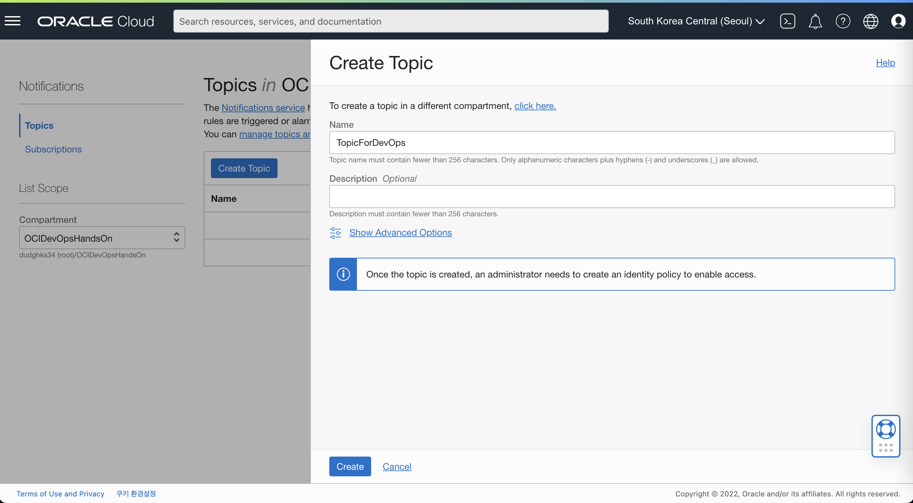
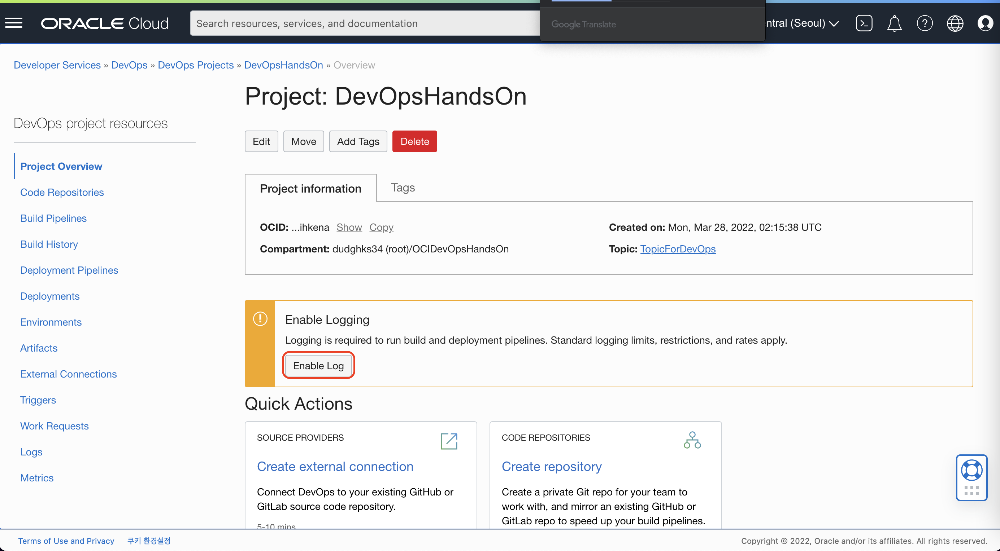
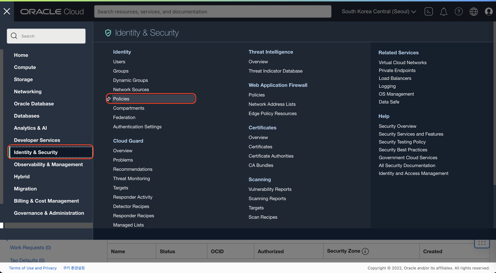
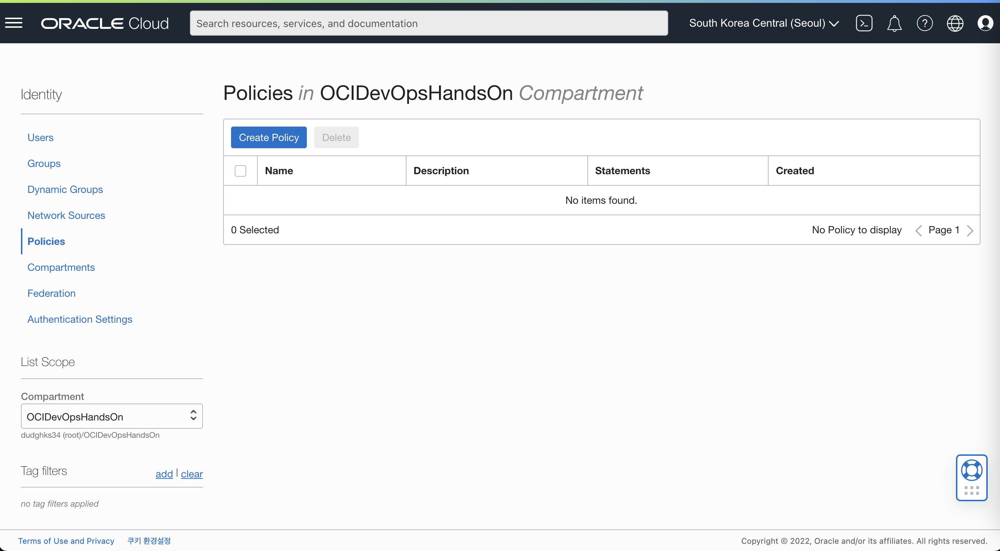
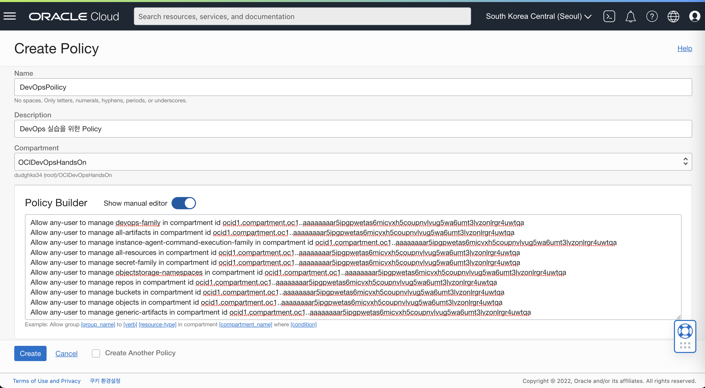

# OCI DevOps 프로젝트 생성

## 소개

실습을 위한 OCI DevOps 프로젝트를 생성하고 필요한 정책을 생성하는 과정을 실습을 통해 학습할 수 있습니다.

소요시간: 5 minutes

### 목표

- Notification Topic 생성
- OCI DevOps Project 생성
- Dynamic Group 생성 및 IAM Policy 적용

### 사전 준비사항

1. 실습을 위한 노트북 (Windows, MacOS)
1. Oracle Free Tier 계정

## Task 1: Notification 생성

> **Note**: 화면 언어는 English로 설정하고 진행합니다. 언어 변경은 우측 상단의 **Language** 아이콘을 선택하고 변경할 수 있습니다.

1. 좌측 상단의 **햄버거 아이콘**을 클릭하고, **Developer Services**을 선택한 후 Application Integration의 **Notifications**를 클릭합니다.
   

1. **Create Topic**을 클릭합니다.
   

1. 다음과 같이 입력:
   - Name: Enter **TopicForDevOps**
   - **Create** 클릭
   

1. 생성된 Topic을 확인합니다.
   

## Task 2: OCI DevOps Project 생성

1. **햄버거 메뉴**를 클릭한 후, **Developer Services**, **DevOps**를 선택합니다.
   

1. **OCIDevOpsHandsOn** 컴파트먼트를 선택한 후에 **Create Project**를 클릭합니다.
   

1. 다음과 같이 입력:
   - Name : DevOpsHandsOn
   - **Select Topic** 클릭 후 앞서 생성한 Topic을 선택합니다.
   - **Create DevOps project** 클릭하여 Project를 생성합니다.
   
   

1. 프로젝트 생성 후 **Enable Log** 버튼을 클릭합니다.
   

1. 프로젝트의 Logs 화면으로 이동 후 **Enable Log** 스위치 버튼을 클릭합니다
   

1. 다음과 같이 선택 후 **Enable Log** 버튼을 클릭합니다.
   - Compartment : **OCIDevOpsHandsOn**
   - 나머지 항목은 기본값에서 변경하지 않습니다.
   

## Task 3: 실습을 위한 IAM Policy 적용

1. **햄버거 메뉴**를 클릭한 후, **Identity & Security**, **Compartments**를 선택합니다.
   

1. Compartments 화면에서 **OCIDevOpsHandsOn** 클릭 후 OCID를 복사해 따로 보관합니다
   
   

1. **햄버거 메뉴**를 클릭한 후, **Identity & Security**, **Policies**를 선택합니다.
   

1. **Create Policy** 버튼을 클릭합니다
   

1. 다음과 같이 입력합니다:
   - Name : **DevOpsPolicy**
   - Description : **DevOps 실습을 위한 Policy**
   - Comparments : **OCIDevOpsHandsOn**
   - Policy 입력 예시 **[Compartments OCID]** 에 위에서 복사한 구획의 OCID로 변환하여 입력합니다
    ````shell
    <copy>
    Allow any-user to manage devops-family in compartment id [Compartments OCID]
    Allow any-user to manage all-artifacts in compartment id [Compartments OCID]
    Allow any-user to manage instance-agent-command-execution-family in compartment id [Compartments OCID]
    Allow any-user to manage all-resources in compartment id [Compartments OCID]
    Allow any-user to manage secret-family in compartment id [Compartments OCID]
    Allow any-user to manage objectstorage-namespaces in compartment id [Compartments OCID]
    Allow any-user to manage repos in compartment id [Compartments OCID]
    Allow any-user to manage buckets in compartment id [Compartments OCID]
    Allow any-user to manage objects in compartment id [Compartments OCID]
    Allow any-user to manage generic-artifacts in compartment id [Compartments OCID]
    </copy>
    ````

    ````shell
    <copy>
    Allow any-user to manage devops-family in compartment id ocid1.compartment.oc1..aaaaaaaar5ipgpwetas6micvxh5coupnvlvug5wa6umt3lvzonlrgr4uwtqa
    Allow any-user to manage all-artifacts in compartment id ocid1.compartment.oc1..aaaaaaaar5ipgpwetas6micvxh5coupnvlvug5wa6umt3lvzonlrgr4uwtqa
    Allow any-user to manage instance-agent-command-execution-family in compartment id ocid1.compartment.oc1..aaaaaaaar5ipgpwetas6micvxh5coupnvlvug5wa6umt3lvzonlrgr4uwtqa
    Allow any-user to manage all-resources in compartment id ocid1.compartment.oc1..aaaaaaaar5ipgpwetas6micvxh5coupnvlvug5wa6umt3lvzonlrgr4uwtqa
    Allow any-user to manage secret-family in compartment id ocid1.compartment.oc1..aaaaaaaar5ipgpwetas6micvxh5coupnvlvug5wa6umt3lvzonlrgr4uwtqa
    Allow any-user to manage objectstorage-namespaces in compartment id ocid1.compartment.oc1..aaaaaaaar5ipgpwetas6micvxh5coupnvlvug5wa6umt3lvzonlrgr4uwtqa
    Allow any-user to manage repos in compartment id ocid1.compartment.oc1..aaaaaaaar5ipgpwetas6micvxh5coupnvlvug5wa6umt3lvzonlrgr4uwtqa
    Allow any-user to manage buckets in compartment id ocid1.compartment.oc1..aaaaaaaar5ipgpwetas6micvxh5coupnvlvug5wa6umt3lvzonlrgr4uwtqa
    Allow any-user to manage objects in compartment id ocid1.compartment.oc1..aaaaaaaar5ipgpwetas6micvxh5coupnvlvug5wa6umt3lvzonlrgr4uwtqa
    Allow any-user to manage generic-artifacts in compartment id ocid1.compartment.oc1..aaaaaaaar5ipgpwetas6micvxh5coupnvlvug5wa6umt3lvzonlrgr4uwtqa
    </copy>
    ````
    

[다음 랩으로 이동](#next)
