# OCI Code Repository를 이용하여 소스코드 관리하기

## 소개

OCI Code Repository를 이용하여 소스코드를 관리하는 방법을 실습을 통해 학습니다.
OCI 의 Private Code Repository를 생성하여 소스코드를 관리하고, 외부 SCM(GitHub,GitLab)으로 부터 레파지토리를 Clone하거나 Mirroring하는 방법을 학습합니다.

소요시간: 25 minutes

### 목표

- OCI Code Repository 생성 후 Cloud Shell을 통해 소스코드 관리 실습
- GitHub 또는 GitLab에 이미 생성된 Repository 를 Clone하여 Code Repository 생성 방법
- 외부 연결을 생성하여 GitHub 또는 GitLab에 이미 생성된 Repository 를 Mirroring하여 Code Repository 생성 방법

### 사전 준비사항

1. 실습을 위한 노트북 (Windows, MacOS)
1. Oracle Free Tier 계정
1. GitHub 또는 GitLab 계정

## Task 1: Repository 생성 및 연결 URL 확인

1. 좌측 상단의 **햄버거 아이콘**을 클릭하고, **Developer Services**을 선택한 후 **DevOps - Projects**를 클릭합니다.
   

2. **OCIDevOpsHandsOn** Compartment를 선택 후 **DevOpsHandsOn** 프로젝트를 클릭합니다.
   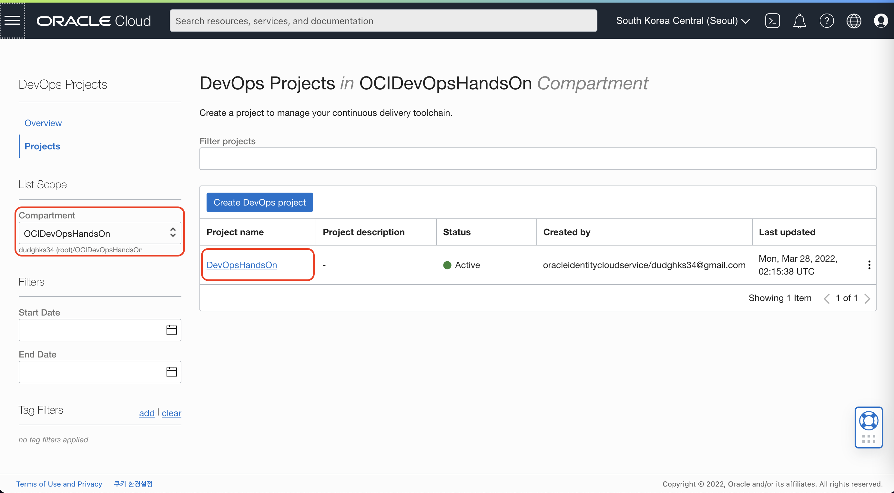

3. 왼쪽의 DevOps resource 메뉴에서 **Code Repository**를 클릭합니다.
   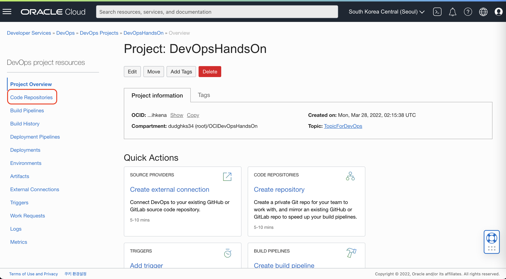

4. **Create Repository** 버튼을 클릭합니다.
   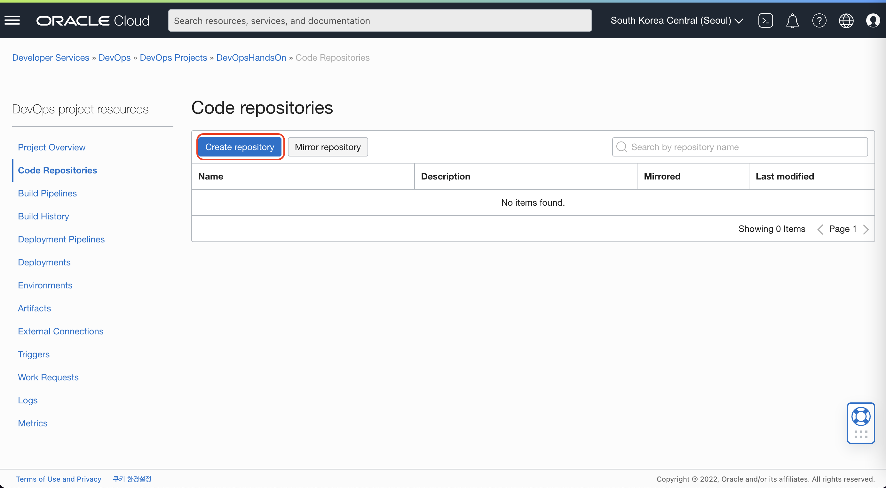

5. 다음과 같이 입력합니다:
   - Repository name : **spring-boot-docker**
   - **Create Repository** 버튼을 클릭하여 Repository를 생성합니다.
   
   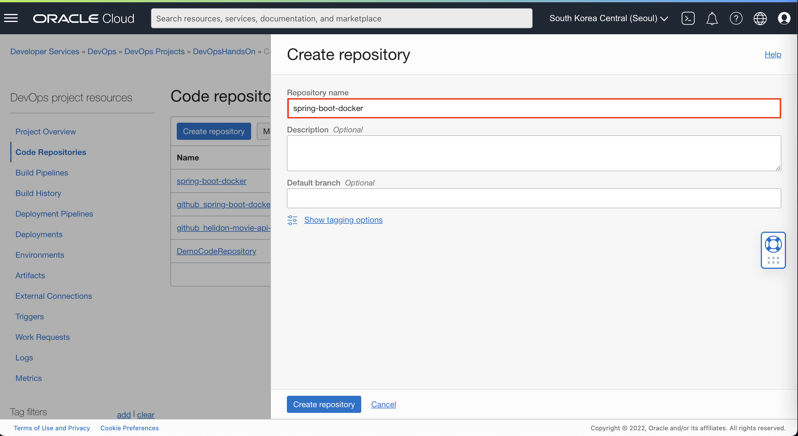
   
6. 생성된 Repository 화면에서 **Clone** 버튼을 클릭하여 Repository의 Clone URL을 확인 합니다.
   
   

7. Repository가 빈 상태인 경우 스크롤을 아래로 내려서 연결 방법을 확인할 수 있습니다
   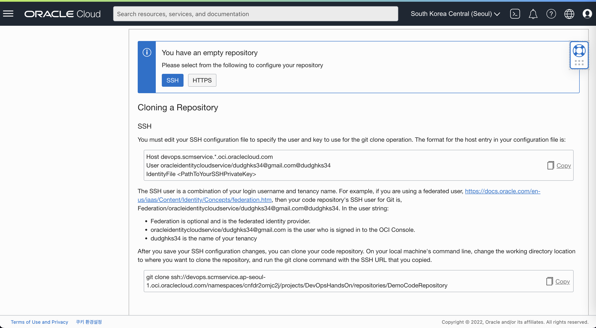
   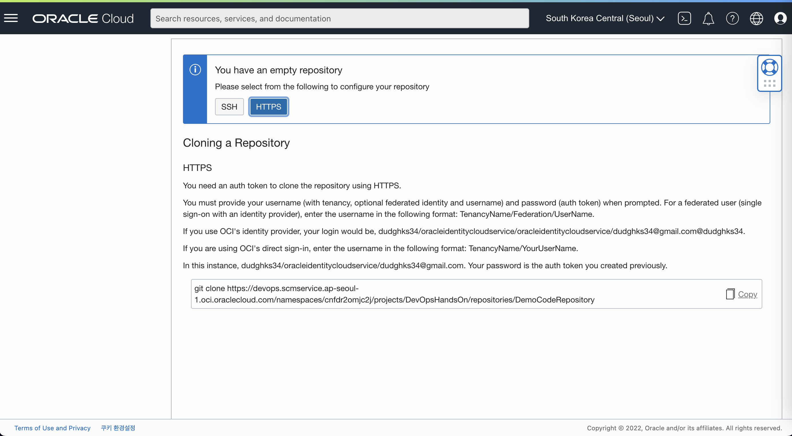

## Task 2: Code Repository 연결 실습
1. 오른쪽 상단 프로파일 아이콘을 클릭하여 현재 로그인한 User 상세 화면으로 이동합니다
   - 기존계정 (도메인 x)
   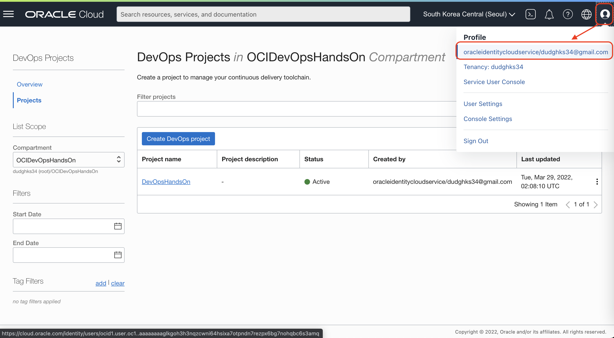
   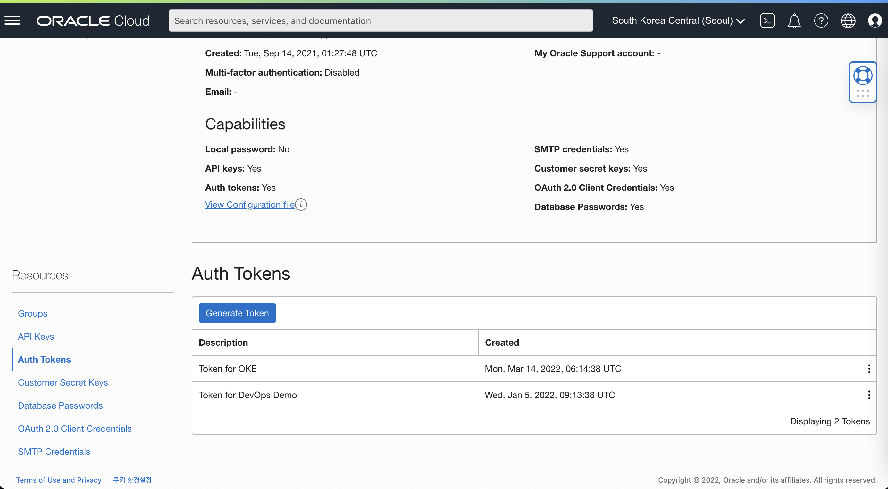
   - 도메인 계정
   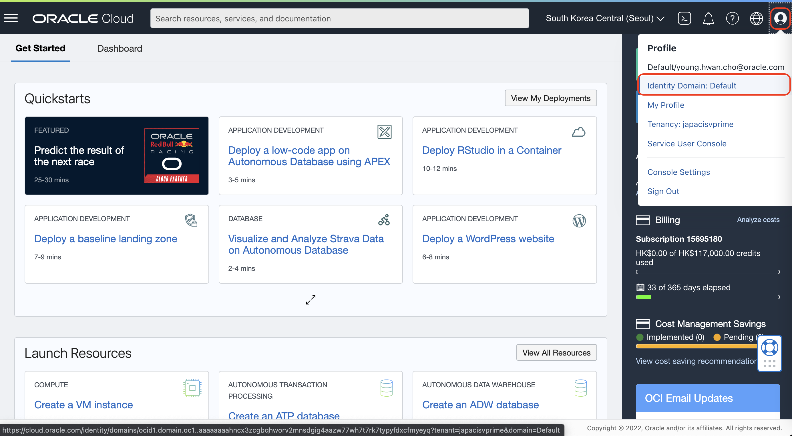   
   
   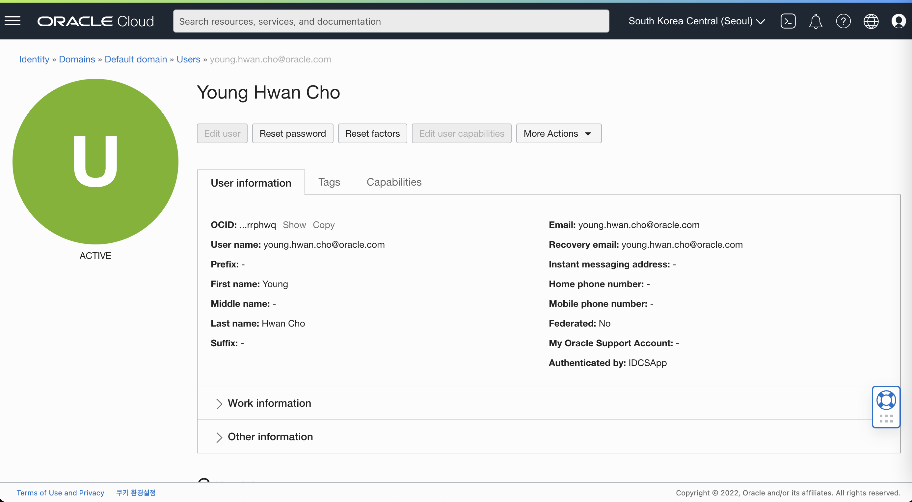

2. **Auth Token** 메뉴로 이동하여 **Generate Token**버튼을 클릭하여 토큰을 생성합니다
   > **Note**: 토큰 정보는 다시 확인할 수 없기 때문에 별도로 저장이 필요합니다

   - Description : **Token for DevIps HandsOn**
   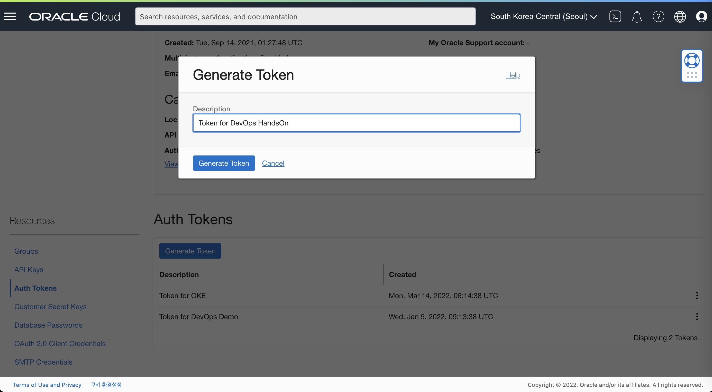
   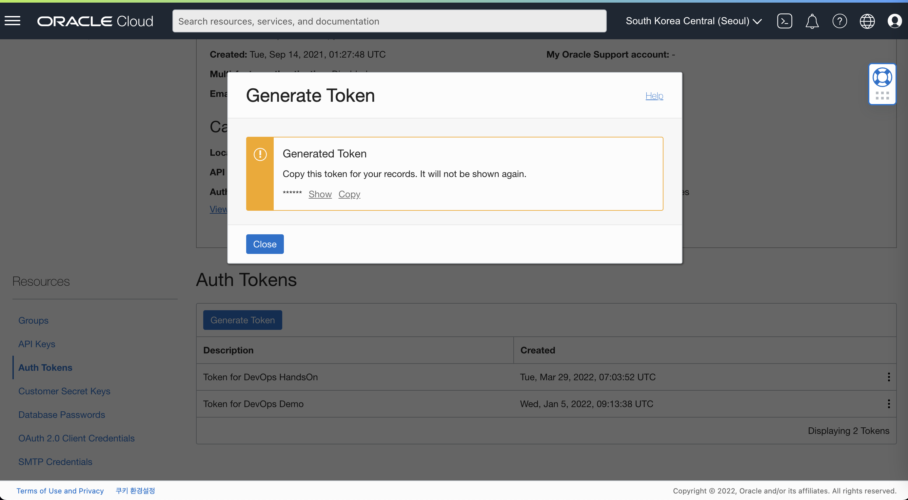

3. OCI Console 우측 상단의 **Cloud Shell** 아이콘을 클릭하여 Cloud Shell을 실행 합니다
   

4. 아래 명령어를 이용하여 실습에 사용할 소스코드를 내려 받습니다.
      ````shell
      <copy>
      git clone https://github.com/yhcho87/spring-boot-docker.git
      </copy>
      ````
5. 내려받은 폴더로 이동하여 아래 명령어를 입력하여 기존 remote 정보 및 repository 정보를 삭제 합니다.
      ````shell
      <copy>
      cd spring-boot-docker

      git remote remove origin
      rm -rf .git/
      </copy>
      ````
6. 아래 명령어를 입력하여 repository를 초기화 합니다.
      ````shell
      <copy>
      git init
      </copy>
      ````
7. [Task 1]에서 생성한 Code Repository 하단에서 Git Clone 명령어의 URL과 User Name을 확인합니다
   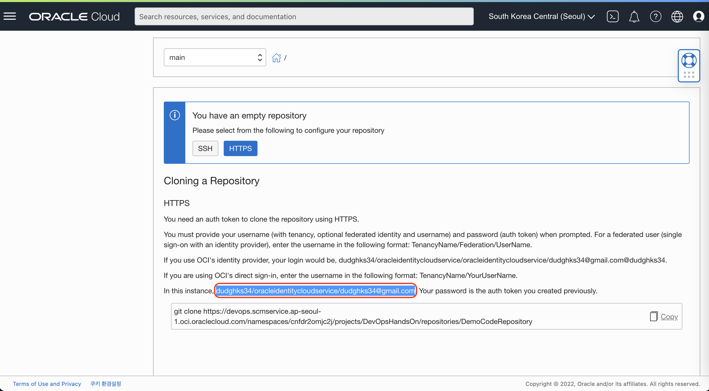

8. OCI DevOps의 Code Repository의 URL을 새로운 remote로 등록합니다.
   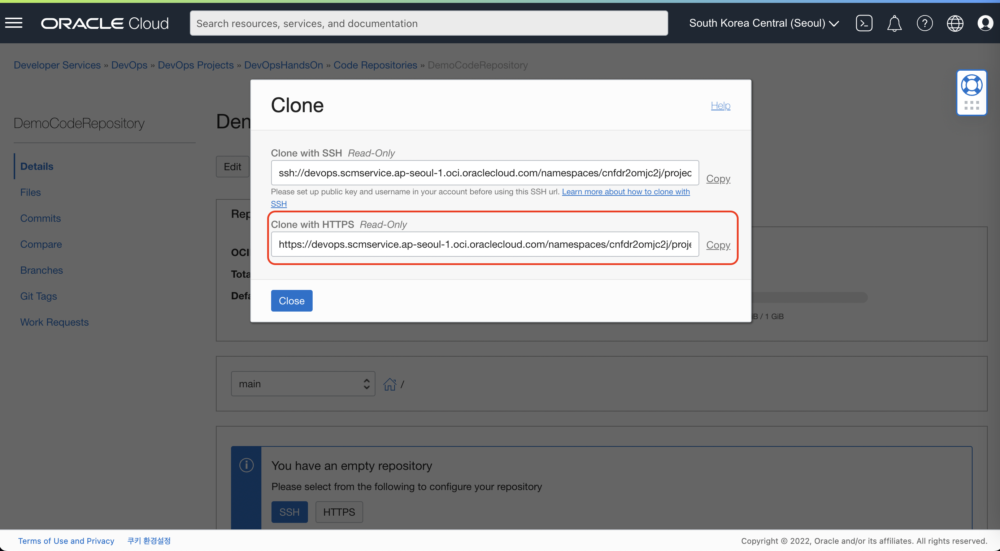
      ````shell
       <copy>
       git remote add origin [개인별 생성된 Repo URL 입력]
       </copy>
      ````

9. Cloud Shell 에서 아래 명령어를 입력하여 User Email, User Name을 설정합니다.
   
      ````shell
      <copy>
      git config --global user.email "[개인이메일]"
      git config --global user.email "dudghks34@gmail.com"
      git config --global user.name "[식별을 위한 이름]"
      git config --global user.name "YoungHwan"
      </copy>
      ````
10. git pull 명령어와 아래 내용을 참조하여 Username/Password를 입력합니다
      ````shell
       <copy>
       git pull origin main
       </copy>
      ````
    - UserName은 [Tenancy ID]/[User ID] 로 구성됩니다. (예시, dudghks34/oracleidentitycloudservice/dudghks34@gmail.com)
    - Password는 생성한 Auth Token을 입력합니다
11. 아래 명령어를 입력하여 실습 코드를 Code Repository에 Push 합니다.
      ````shell
       <copy>
       git branch -M main
       git add .
       git commit -m "First Commit"
       git push -u origin main
       </copy>
      ````
    - UserName은 [Tenancy ID]/[User ID] 로 구성됩니다. (예시, dudghks34/oracleidentitycloudservice/dudghks34@gmail.com)
    - Password는 생성한 Auth Token을 입력합니다

12. Push한 파일을 OCI Console에서 확인합니다.
    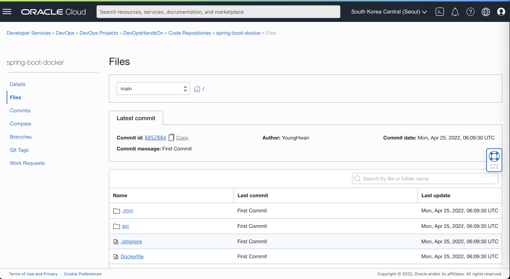
    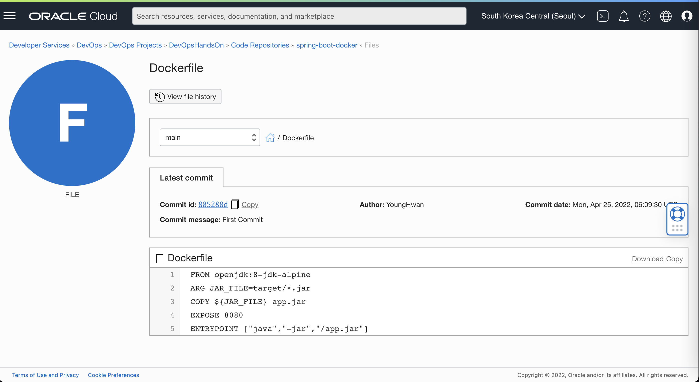

## Task 3:(Option) 외부 Repository Mirroring (GitHub)

1. 외부 연결 생성을 위해 GitHub 사이트에서 PAT를 생성합니다.
   - 프로필 아이콘을 클릭하여 **[Settings]** 메뉴로 이동합니다
   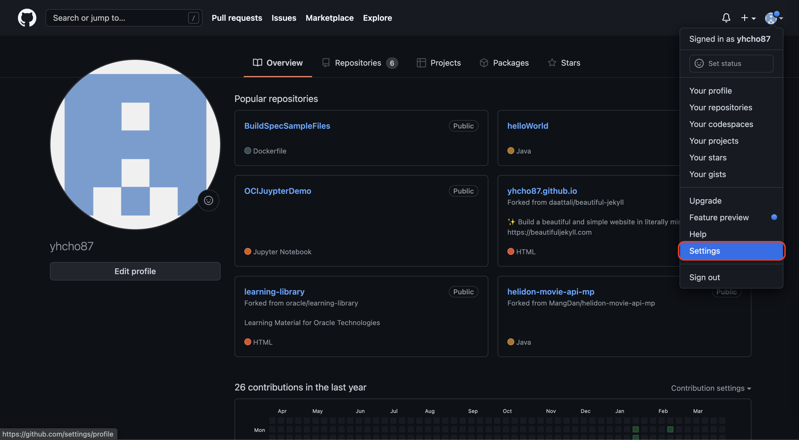
   - 왼쪽 하단 Developer settings 메뉴를 클릭합니다
   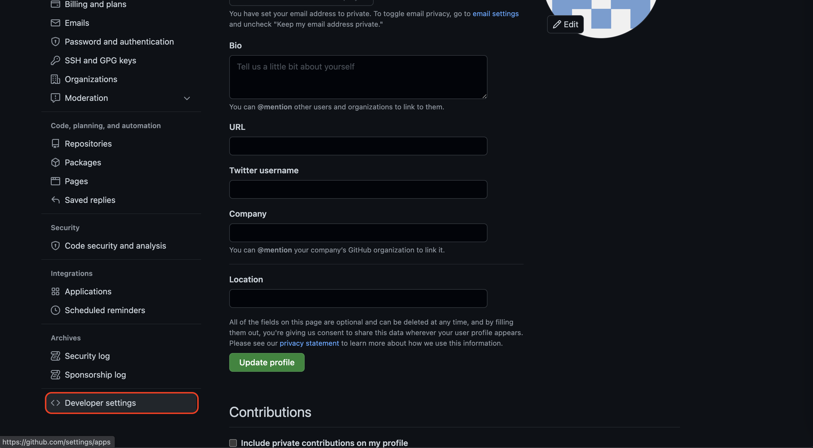
   - **Personal access token**을 클릭 후 **Generate new token**을 클릭합니다.
   
   - Token 이름을 입력 후 만료기간 없음으로 선택, repo 관련 기능을 추가 후 **Create** 합니다.
   
   - **생성된 토큰은 다시 확인할 수 없기 때문에 별도로 보관합니다.**
   

2. 좌측 상단의 **햄버거 아이콘**을 클릭하고, **Identity & Security**을 선택한 후 **Vault**를 클릭합니다.
   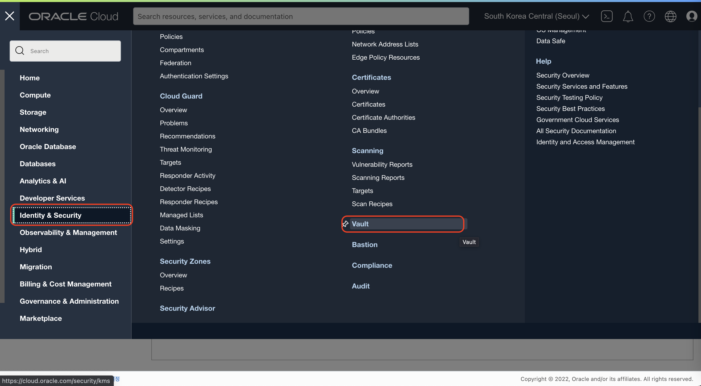

3. 다음과 같이 입력하여 Vault를 생성합니다:
   - Create in Compartment : **OCIDevOpsHandsOn**
   - Name : **VaultForDevOps**
   - **Create Vault**를 클릭하여 Vault를 생성합니다
   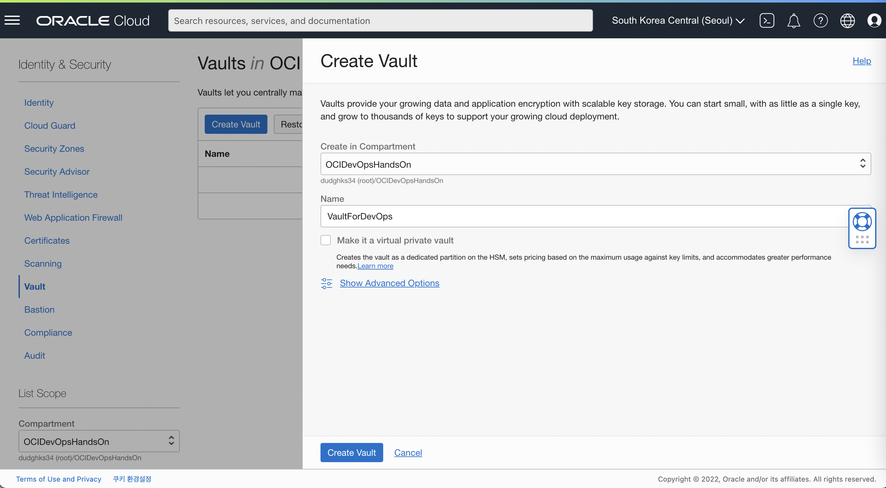
      
4. **Create Key**버튼을 클릭후 다음과 같이 입력하여 Key를 생성합니다:
   - Create in Compartment : **OCIDevOpsHandsOn**
   - Protection Mode : **HSM**
   - Name : **DevOpsKey**
   - **Create Key**를 클릭하여 Key를 생성합니다
   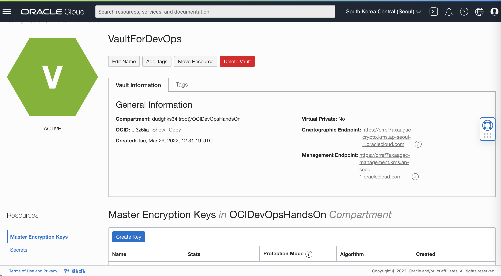
   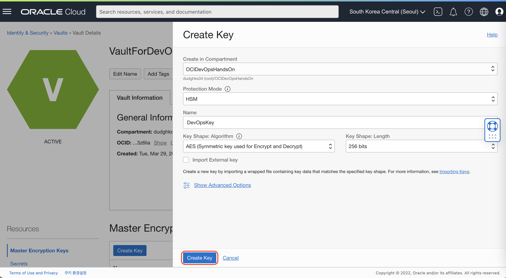
   
5. **Create Key**버튼을 클릭후 다음과 같이 입력하여 Key를 생성합니다:
   - Create in Compartment : **OCIDevOpsHandsOn**
   - Name : **PAT\_GitHub\__[yhcho87]_** -> **_[yhcho87]_**을 개인계정 이름으로 변경합니다. 
   - Encryption Key : **DevOpsKey**
   - Secret Type Template : **Plain-Text**
   - Secret Contents : **[GitHub에서 생성한 PAT Token을 입력합니다]**
   - **Create Secret**를 클릭하여 Secret를 생성합니다
   

6. 아래 링크로 이동하여 실습에 쓰일 프로젝트를 Fork 합니다. (수정필요)
   - [https://github.com/yhcho87/spring-boot-docker](https://github.com/yhcho87/spring-boot-docker)
     

8. **[DevOps Project]**의 Code Repository 에서 **Mirror repository**버튼을 클릭합니다. 
   

9. 다음과 같이 입력하여 GitHub Repository를 Mirroring 합니다.
   - Connection : **GitHub\_yhcho87\_** [본인이 생성한 외부연결을 선택합니다]
   - Repository : **spring-boot-docker**
   - Name : **github_spring-boot-docker**
   - **Mirror repository**를 클릭하여 완료합니다
   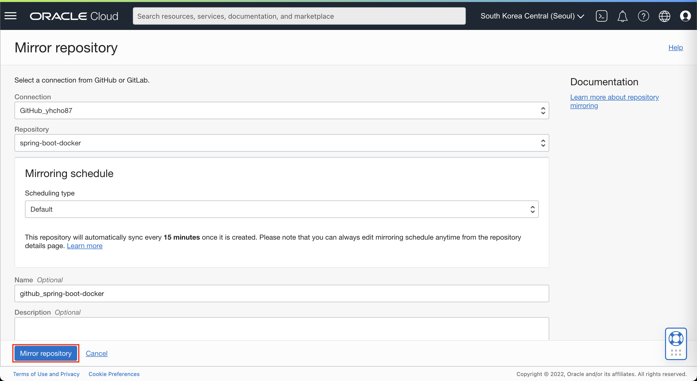

8. 생성된 Mirror Repository를 확인합니다.
   
   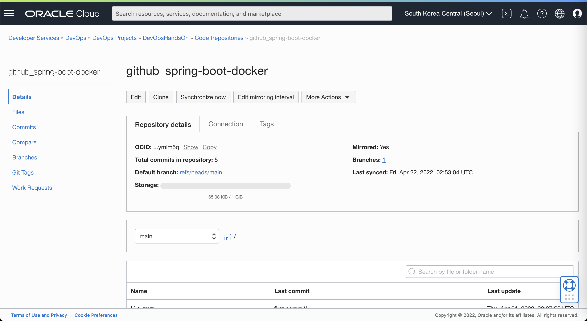

[다음 랩으로 이동](#next)
