# 실습 환경 준비

## 소개

실습을 위한 Oracle 클라우드 환경을 구성합니다. 우선 OCI내의 특정 구획 (Comartment)이 생성될 것이며, 해당 구획내에 가상 클라우드 네트워크 (VCN)가 구성됩니다. 여기서 구획과 VCN은 자체 환경을 격리하고 보호하는 역할을 합니다. 
그리고 빌드된 결과물을 배포할 Compute Instance와 Load Balancer를 구성합니다.
GitHub 계정이 없는 경우 실습 전 [GitHub](https://github.com) 에서 계정 생성 후 진행 부탁 드립니다. 

소요시간: 20 minutes

### 목표

-  Oracle Cloud Infrastructure (OCI) DevOps 실습 환경 구성.  

### 사전 준비사항

1. 실습을 위한 노트북 (Windows, MacOS)
1. Oracle Free Tier 계정
1. Github 계정

## Task 1: OCI Console 로그인

   OCI에 로그인합니다. 

1. 로그인하면 다음과 같은 홈 화면을 볼 수 있습니다. 좌측 상단의 햄버거 모양의 아이콘을 클릭하면 OCI의 모든 메뉴를 확인할 수 있습니다. 

  

1. Dashboard를 클릭하면 기본적인 사용현황을 살펴볼 수 있습니다.

  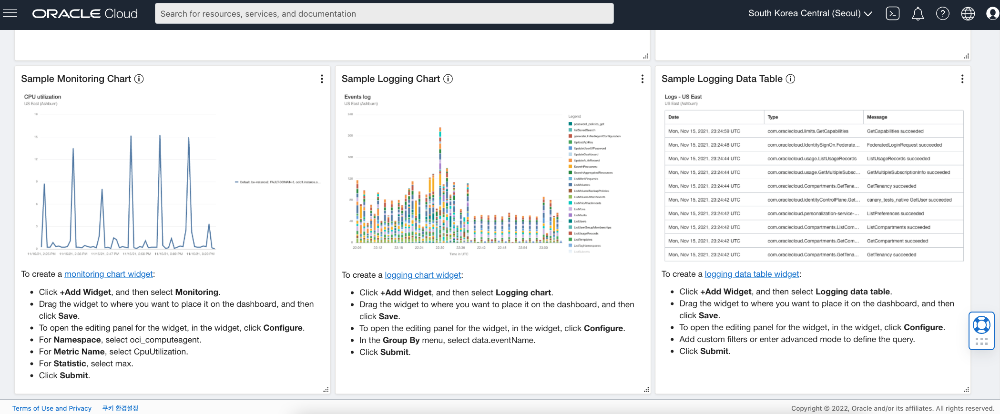

## Task 2: OCI 인프라스트럭처 기본 설정

> **Note**: 화면 언어는 English로 설정하고 진행합니다. 언어 변경은 우측 상단의 **Language** 아이콘을 선택하고 변경할 수 있습니다.

### Compartment 생성

1. 좌측 상단의 **햄버거 아이콘**을 클릭하고, **Identity & Security**을 선택한 후 **Compartments**를 클릭합니다.

   

2. **devops_handson** 구획을 클릭합니다.
   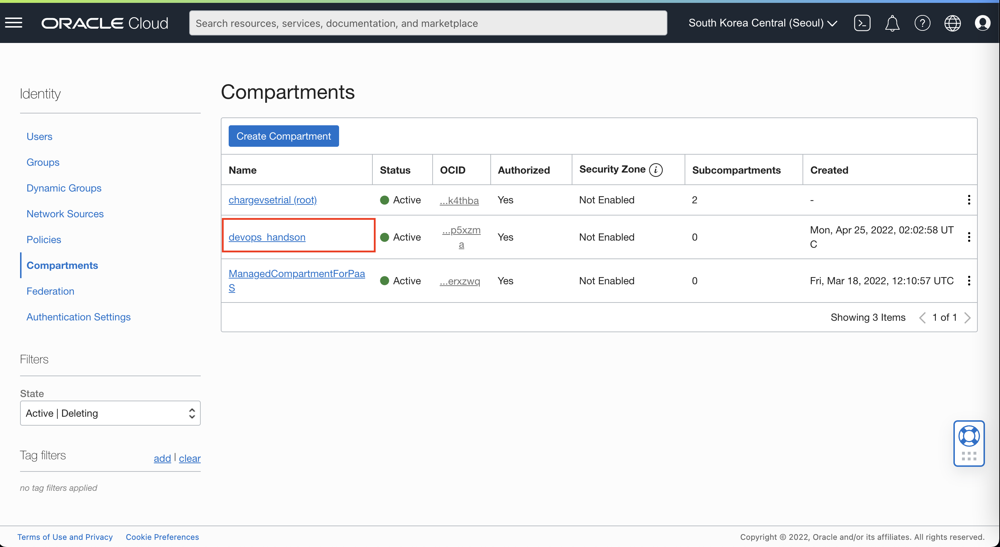
3. 다음과 같이 입력하여 개인별 구획을 먼저 생성합니다.
   - Name: Enter **YoungHwan** [개인별 영문 이름 또는 이니셜]
   - Description: **DevOps 실습을 위한 개인별 구획입니다.**
   - Parent Compartment: **devops_handson**
   - **Create Compartment** 클릭

   
   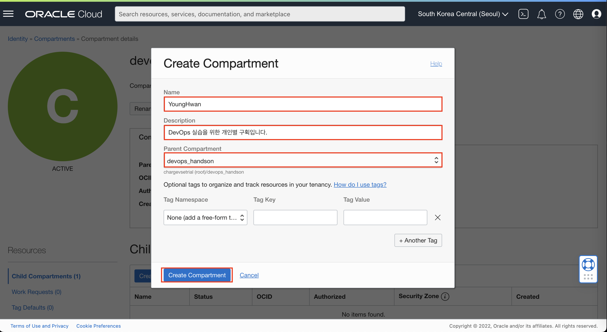
4. 생성된 개인별 구획을 클릭하여 이동 후 다음과 같이 입력하여 실습 구획을 생성합니다:
      - Name: Enter **OCIDevOpsHandsOn**
      - Description: **OCI DevOps 핸즈온을 위한 실습 구획입니다.**
      - Parent Compartment: **YoungHwan** **_[전 단계에서 생성한 개인별 구획을 선택합니다]_**
      - **Create Compartment** 클릭

   
   

### Virtual Cloud Network 생성

1. 좌측 상단의 **햄버거 아이콘**을 클릭하고, **Networking**을 선택한 후 **Virtual Cloud Networks**를 클릭합니다.

   

1. 화면 좌측 하단의 Compartment에서 위에서 생성한 **OCIDevOpsHandsOn**을 선택합니다.
   
   

1. **Start VCN Wizard**를 클릭합니다.

1. **Create VCN with Internet Connectivity**를 선택 후 **Start VCN Wizard**를 클릭합니다.

   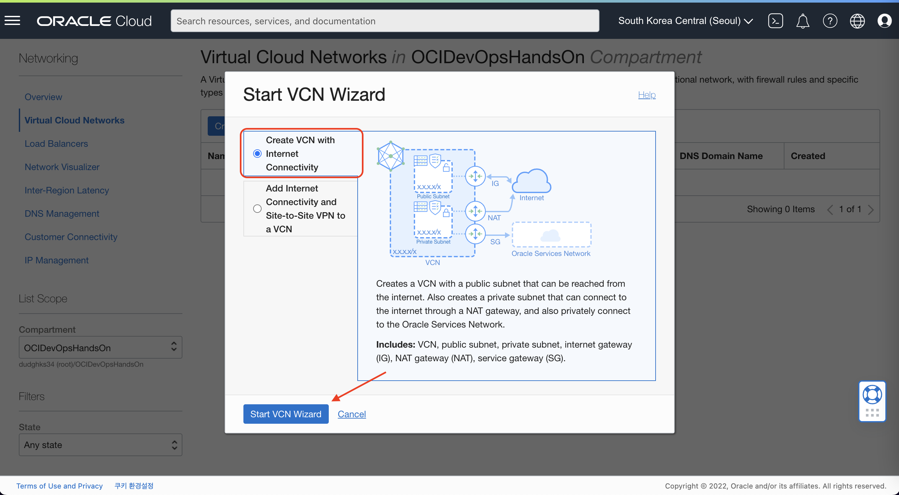

1. 다음과 같이 입력:
      - VCN Name: Enter **VCNforDevOpsHandsOn**
      - VCN CIDR Block: **10.0.0.0/16** (기본값)
      - Public Subnet CIDR Block: **10.0.0.0/24** (기본값)
      - Private Subnet CIDR Block: **10.0.1.0/24** (기본값)
      - **Next** 클릭
   
   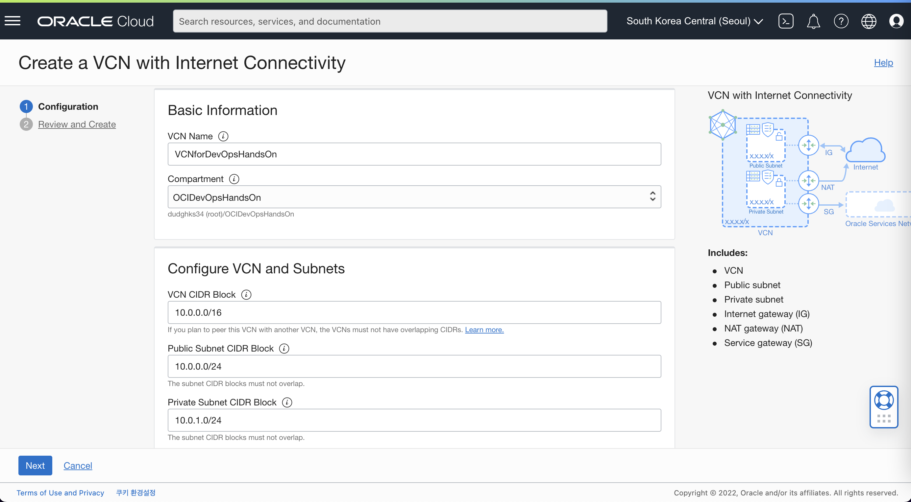

1. 입력된 정보를 확인한 후 하단의 **Create**를 클릭하여 VCN을 생성합니다
   
   
   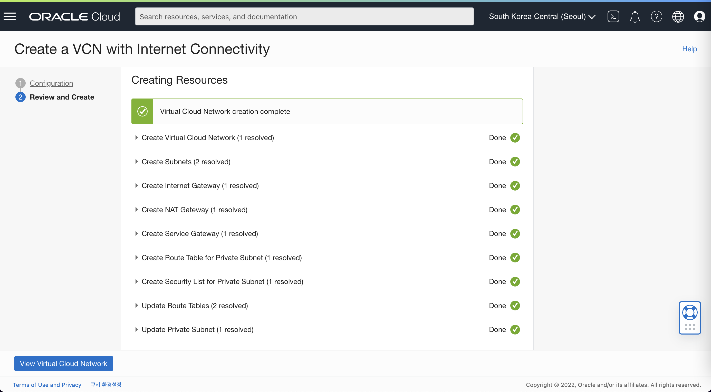

### 보안 목록 작성

1. VCN 목록에서 생성한 **VCNforDevOpsHandsOn**을 클릭 상세보기 창으로 이동합니다.
   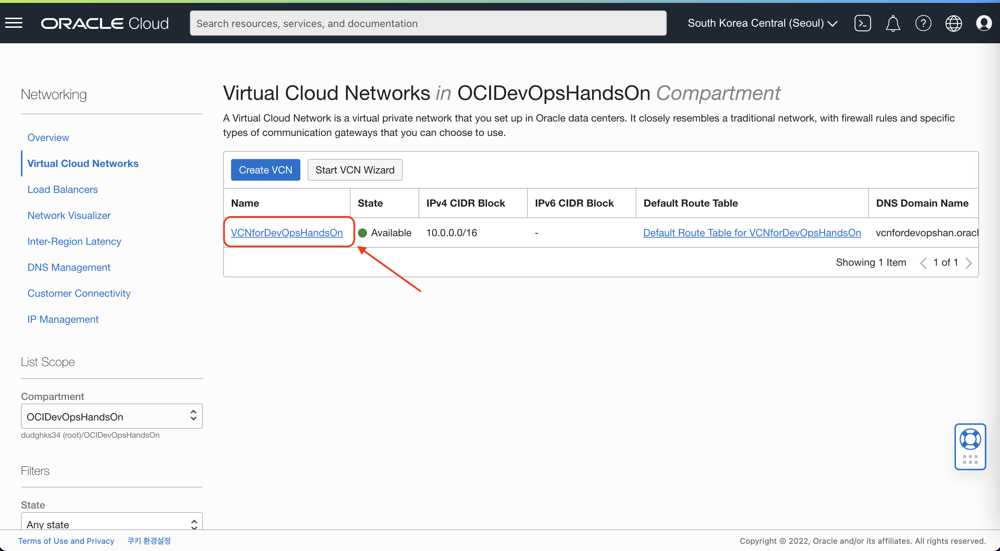

2. VCN 상세보기 화면에서 하단 Subnet 목록중 **Public Subnet-VCNforDevOpsHandsOn**을 클릭 합니다.
   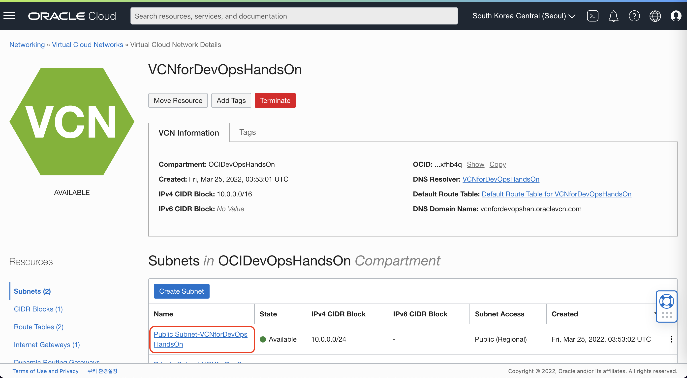

3. Subnet 상세보기 화면에서 하단 Security Lists 목록중 **Default Security List for VCNforDevOpsHandsOn**을 클릭 합니다.
   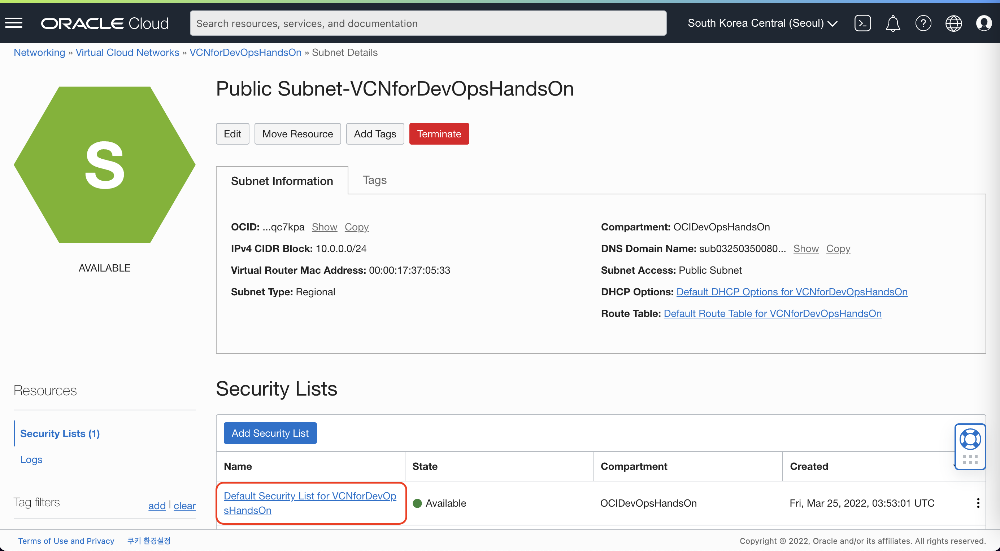

4. **Add Ingress Rules**를 클릭 합니다.
   

5. 다음과 같이 입력:
      - Source Type : **CIDR** (기본값)
      - Source CIDR : Enter **0.0.0.0/0**
      - IP Protocol : **TCP** (기본값)
      - Destination Port Range : **8080**
      - Description : **for Demo Application**
      - **Add Ingress Rules** 클릭
   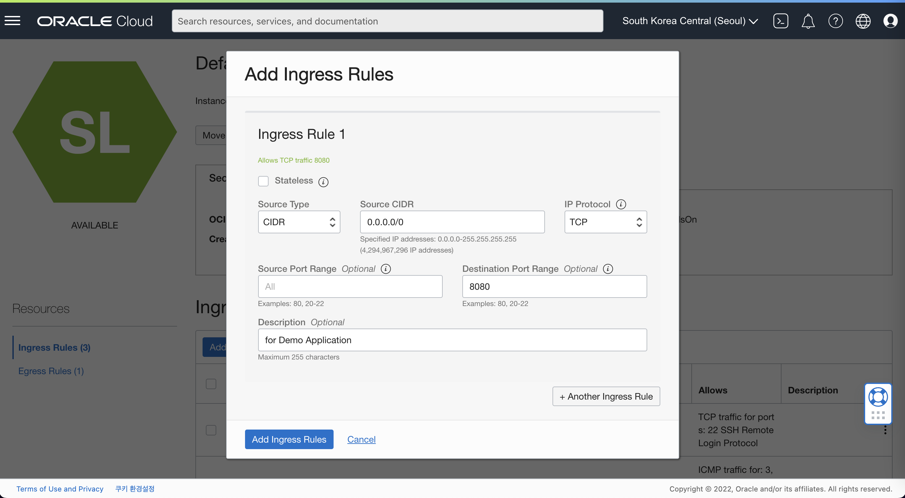

## Task 3 : Compute Instance 생성 및 Instance 기본 설정

### Instance 생성

1. 좌측 상단의 **햄버거 아이콘**을 클릭하고, **Compute**을 선택한 후 **Instances**를 클릭합니다.
   

2. **Create instance**를 클릭합니다.
   

3. 인스턴스 이름과 구획을 선택 합니다
   - Name: Enter **instanceForDemoApp**
   - Create in compartment: **OCIDevOpsHandsOn**
   - Availability domain : **AP-SEOUL-1-AD-1 (Seoul 리전 기준)**
   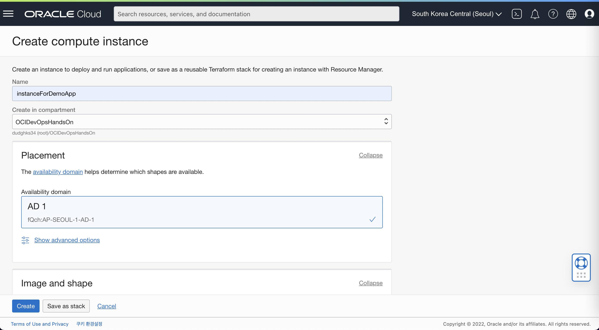

4. 설치할 이미지와 Instance의 Shape을 선택 합니다.
   - Image : **Oracle Linux8 - 2022.02.25-0**
   - Shape : **VM.Standard.E4.Flex (1 OCPU, 16 GB Memory)**
   

5. 네트워크 관련 옵션을 선택 합니다
   - Virtual cloud network : **VCNforDevOpsHandsOn**
   - Subnet : **Public Subnet-VCNforDevOpsHandsOn**
   - Public IP address : **Assign a public IPv4 address**
   

6. VM에 접속할때 사용할 SSH Keys 추가 합니다.
   - 이번 실습에서는 **Generate a key pair for me** 를 선택 후 Private Key, Public Key를 다운받아 잘 보관 합니다.
   - Boot volume 관련 옵션은 기본 설정을 유지 합니다.
   

7. **Create** 버튼을 클릭 후 생성
   - 생성 후 Running 상태를 확인 합니다
   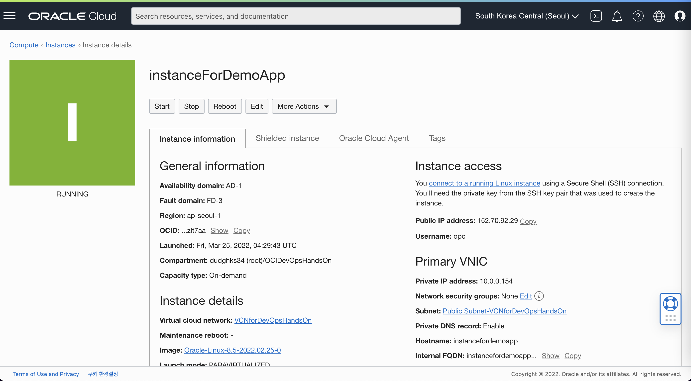

### Instance 접속 및 프로그램 설치

1. 인스턴스 접속 
   - Windows 사용자 (PuttyGen , Putty 사용)
     - PuTTYgen을 실행합니다
     - **Load** 를 클릭 하고 인스턴스를 생성할 때 생성된 프라이빗 키를 선택합니다. 키 파일의 확장자는 **.key**
     - **Save Private Key** 를 클릭 합니다.
     - 키파일의 이름을 지정 합니다. (개인 키의 확장자는 **.ppk**로 저장합니다)
     - **Save** 를 클릭합니다.
     - 새로운 키 파일을 이용하여 인스턴스에 접속 합니다. 
     - 상세내용은 링크를 통해 확인 가능 합니다. [접속 가이드 링크](https://docs.oracle.com/en-us/iaas/Content/Compute/Tasks/accessinginstance.htm#linux__putty)
   - MacOS 사용자
     - 다운로드 받은 키파일의 권한을 조정합니다.
       ````shell
         <copy>
          chmod 400 <private_key_file> #엑세스 하려는 키 파일의 전체 경로 와 이름을 입력합니다.
         </copy>
        ````
     - 다음 명령어를 입력하여 인스턴스에 접속합니다.
       ````shell
         <copy>
          ssh -i <private_key_file> opc@<public-ip-address>
         </copy>
        ````
2. 기본으로 OS에 적용되어 있는 방화벽을 중지 시키기 위해 VM 연결 후 아래 코드를 순차적으로 입력 합니다.
    ````shell
      <copy>
      sudo firewall-cmd --permanent --zone=public --add-port=8080/tcp
      sudo firewall-cmd --reload
      sudo systemctl disable firewalld
      sudo systemctl stop firewalld
      </copy>
    ````
3. Spring Boot 및 Docker 실행을 위한 JDK를 설치합니다.
    ````shell
      <copy>
      sudo yum install jdk1.8.x86_64 -y
   
      #정상설치 확인
      java -version
      </copy>
    ````
   - 결과 출력 예시:
    ````shell
      java version "1.8.0_321"
      Java(TM) SE Runtime Environment (build 1.8.0_321-b07)
      Java HotSpot(TM) 64-Bit Server VM (build 25.321-b07, mixed mode)
    ````
4. Docker 설치 및 서비스 활성화
    ````shell
      <copy>
      # Docker 설치
      sudo yum-config-manager --add-repo https://download.docker.com/linux/centos/docker-ce.repo
      sudo yum install docker-ce docker-ce-cli containerd.io -y
      
      # Docker 서비스 시작 및 연결
      sudo systemctl start docker
      sudo systemctl enable docker
      
      # Docker 서비스 실행권한 조정
      sudo chmod 777 /var/run/docker.sock
   
      # 정상 설치 확인
      docker version
      </copy>
    ````
   - 결과 출력 예시:
    ````shell
      Client: Docker Engine - Community
      Version:           20.10.14
      API version:       1.41
      Go version:        go1.16.15
      Git commit:        a224086
      Built:             Thu Mar 24 01:47:44 2022
      OS/Arch:           linux/amd64
      Context:           default
      Experimental:      true
      
      Server: Docker Engine - Community
      Engine:
      Version:          20.10.14
      API version:      1.41 (minimum version 1.12)
      Go version:       go1.16.15
      Git commit:       87a90dc
      Built:            Thu Mar 24 01:46:10 2022
      OS/Arch:          linux/amd64
      Experimental:     false
      containerd:
      Version:          1.5.11
      GitCommit:        3df54a852345ae127d1fa3092b95168e4a88e2f8
      runc:
      Version:          1.0.3
      GitCommit:        v1.0.3-0-gf46b6ba
      docker-init:
      Version:          0.19.0
      GitCommit:        de40ad0
    ````

[다음 랩으로 이동](#next)
